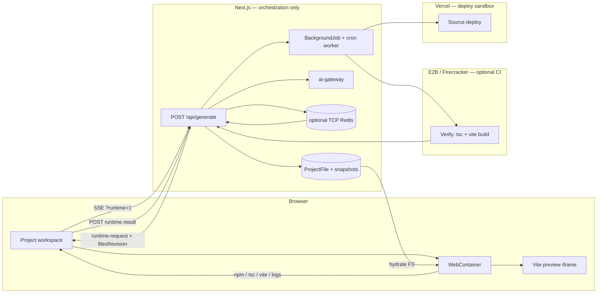
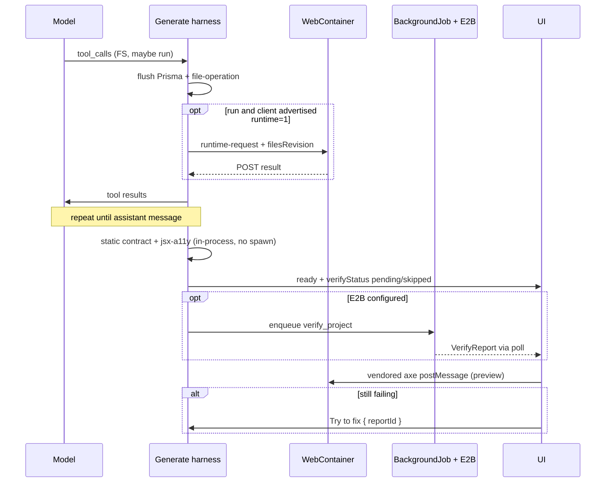
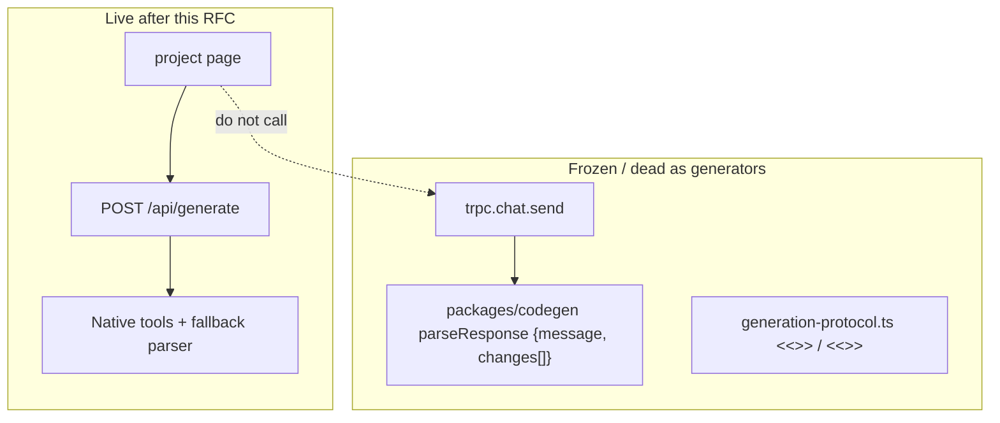

# Sovereign Agent Runtime: Native Tools, Verify Loop, and Vite Apps That Actually Build

| Field            | Value                                                                                                                                                         |
| ---------------- | ------------------------------------------------------------------------------------------------------------------------------------------------------------- |
| **Author**       | Architecture (draft for engineering review)                                                                                                                   |
| **Date**         | 2026-08-30                                                                                                                                                    |
| **Status**       | **Partially implemented** — see "Implementation status" below before treating any section as current behavior.                                                |
| **Audience**     | Senior engineers working in `apps/web`, `packages/ai-gateway`, `packages/codegen`                                                                             |
| **Related code** | `apps/web/src/app/api/generate/route.ts`, `apps/web/src/lib/agent-protocol.ts`, `apps/web/src/lib/use-webcontainer.ts`, `packages/ai-gateway/src/provider.ts` |

---

## Implementation status

This is a design document, not a description of the shipped system. Verified
against the code after it was written:

**Shipped**

- Native OpenAI-compatible `tool_calls` in the generate loop
  (`apps/web/src/lib/agent-tools.ts`, `packages/ai-gateway/src/tool-calls.ts`),
  with JSON-in-text retained as the fallback for providers without tool support
  (`nativeToolsEnabled`).
- Vite-in-WebContainer preview with a static-file-server fallback
  (`apps/web/src/lib/preview-startup.ts`, `use-webcontainer.ts`).
- `applyStackContract` autofix, version snapshots, and the design-direction flow
  (`packages/codegen/src/contract.ts`, `apps/web/src/lib/versioning.ts`).

**Not implemented** (the sections below describe intended design only)

- The `GenerationRun` / `GenerationToolTrace` / `VerifyReport` / `AgentPlan`
  model exists in `prisma/schema.prisma`, but **no application code reads or
  writes those tables**. There is no run persistence, tool-call tracing, verify
  loop, or auto-fix counter.
- `POST /api/generate/runtime/[runId]`, the E2B verify path, and the
  Plan-vs-Build mode split.

Read the "Verify loop" and "Data Model Changes" sections as a proposal. Delete
this notice once the corresponding code lands.

---

## Overview

> **Historical snapshot:** This overview and the `Background & Motivation` details below describe the code when this RFC was drafted on August 30, 2026. They explain the original proposal and may not match current behavior. Use the implementation status above and the referenced source files for the current state.

Sovereign already has the shape of a coding agent: a streaming loop at `POST /api/generate`, a filesystem of `ProjectFile` rows, version snapshots, a visual editor, and a browser WebContainer preview. It does **not** yet have a professional agent loop. The model is asked to dump JSON actions in prose (`AGENT_SYSTEM_PROMPT` in `apps/web/src/app/api/generate/route.ts`). The harness scrapes those objects with `parseAgentAction` (`apps/web/src/lib/agent-protocol.ts`). Native `tools` exist on `ProviderCompleteOptions` (`packages/ai-gateway/src/types.ts`) but generate never passes them, and the OpenAI-compatible stream parser never extracts `delta.tool_calls`. The agent's "computer" is an in-memory `Map<string, string>` of Prisma rows, not a runtime that can `npm install`, typecheck, or return console errors. Preview is a static Node HTTP server written into WebContainer (`.sovereign-preview.mjs` in `use-webcontainer.ts`) that does **not** run Vite, does **not** install dependencies, and does **not** feed logs back to the model. Deploy writes `https://stub.localhost/{slug}/vN`. Accessibility is a prompt hope, not a gate.

This document specifies the smallest architecture that can rival Lovable, Replit Agent, and Bolt.new on a metric we can actually hit in this wave: **the preview runs a real Vite app, and a static production build can deploy to a real URL**. The sequence is explicit and incremental: native tool_calls → Vite-in-WebContainer preview → agent drives that same WebContainer → automatic verify (static lint + optional sandboxed `vite build`) → Plan vs Build → cheap autofixers → Vercel source deploy. Subagents, MCP, grep-at-scale, computer-use, and SSR/API routes are **out of this RFC**.

**Runtime pick: Option C, restated honestly.** WebContainer is the **only** interactive computer (`run` never executes on the Next.js host). Production verify/build runs in **E2B (or equivalent VM)** when configured, otherwise the gate is an honest skip and Vercel’s own builder is the sandbox at deploy time. There is no `child_process` of agent-authored `package.json` scripts on the builder host.

---

## Background & Motivation

### Current live path (verified)

The project page (`apps/web/src/app/project/[id]/page.tsx`, 1,843 lines) is the only builder UX. `handleSend` POSTs to `/api/generate` and consumes SSE via `consumeGenerationStream` (`apps/web/src/lib/generation-stream.ts`). It does **not** call `trpc.chat.send`.

`POST /api/generate` then:

1. Authenticates via NextAuth, rate-limits (`checkRateLimit('prompt')`), authorizes OWNER/EDITOR.
2. Decrypts a BYOK key with AES-256-GCM (`apps/web/src/lib/crypto.ts`).
3. Loads `ProjectFile` rows into `const files = new Map(project.files.map(...))` — **not a disk workspace**.
4. Builds a 10-message history plus a giant user blob (name, description, empty/existing flag, path manifest, optional `editTarget`, attachments, image-gen capability).
5. Loops up to `MAX_ITERATIONS = 40`. Each iteration calls `provider.stream(...)` with `trimMessagesForContext` (`CONTEXT_BUDGET_CHARS = 80_000`). `trimMessagesForContext` **always retains** `messages[0]` when it is `role: system`; it skips over-budget _middle_ messages rather than dropping the system prompt.
6. Parses the entire completion as JSON-in-text. Three consecutive parse failures abort. Five consecutive non-mutating turns abort.
7. Executes `think | read_files | write_file | edit_file | delete_file | generate_images | propose_design_directions | ask_questions | respond | finish`.
8. Batches file mutations into one Prisma transaction + `createVersion` (`apps/web/src/lib/versioning.ts`). Generate currently calls `createVersion(tx, projectId, null, changes)` — `sourceMessageId` is null, and `createVersion` has no `message` argument.
9. Streams SSE: `phase`, `step`, `thinking`, `answer`, `file-preview`, `file-operation`, `image-job`, `design-directions`, `questions`, `ready`, `failed`. `answer` carries a cumulative snapshot of the user-facing answer text (`respond.message` / `finish.summary` / plain prose) while the model writes it, and `content: ""` when a turn settles as a tool call; `ready` remains authoritative. `consumeGenerationStream` **drops unknown event names** (lines 118–138).
10. The route is `dynamic = 'force-dynamic'` and the repo contains **zero** `maxDuration` exports.

The client writes previewed files into WebContainer at a 120 ms throttle and bumps an iframe `revision` at 500 ms (`page.tsx` ~642–648). The agent never sees whether Vite started, whether `npm` failed, or whether the iframe threw. `WebContainer.boot({ forwardPreviewErrors: 'exceptions-only' })` is already set (`use-webcontainer.ts` line 26); nothing consumes those events.

`ToolStepsDisplay` is an **inner function** of `page.tsx` (~line 177), not a shared component. The model picker buttons live ~line 1400; the effort submenu is ~1427.

### Pain points (ranked by user-visible impact)

| Severity | Pain                                       | Evidence                                                                                                                                                                                                                                                                                                                                                                                                                                                                                                                                                                                                                                                                                                                                                  |
| -------- | ------------------------------------------ | --------------------------------------------------------------------------------------------------------------------------------------------------------------------------------------------------------------------------------------------------------------------------------------------------------------------------------------------------------------------------------------------------------------------------------------------------------------------------------------------------------------------------------------------------------------------------------------------------------------------------------------------------------------------------------------------------------------------------------------------------------- |
| **P0**   | Preview does not run a real React/Vite app | `useWebContainer` spawns `node .sovereign-preview.mjs`, a static file server. TSX is not compiled. `npm` is never invoked. `__sovereign_hmr/refresh` is fetched by `triggerRefresh` but **is not implemented** in that server.                                                                                                                                                                                                                                                                                                                                                                                                                                                                                                                            |
| **P0**   | Agent cannot observe runtime               | No `run` tool. `sandbox.logs` stay in React state. `AgentStepKind` includes `'verify'` but generate never emits it.                                                                                                                                                                                                                                                                                                                                                                                                                                                                                                                                                                                                                                       |
| **P0**   | Protocol is brittle                        | JSON scraped from prose; `write_file` dumps entire files as escaped strings; parse retries burn full 32k-token completions.                                                                                                                                                                                                                                                                                                                                                                                                                                                                                                                                                                                                                               |
| **P1**   | Dual generation stacks                     | Live path: generate + `agent-protocol`. Dead path: `trpc.chat.send` + `packages/codegen` `parseResponse` (`{ message, changes[] }` with `write\|delete\|ask_user`) + a separate `generation-protocol.ts` `<<<FILE:>>>` / `<<<PATCH:>>>` dialect. `agent-protocol.ts` **imports types** (`ClarifyingQuestion`, `GeneratedFile`) from `generation-protocol.ts`; generate does not parse `<<<FILE:>>>`. Three dialects, one UI.                                                                                                                                                                                                                                                                                                                              |
| **P1**   | Outputs are demos                          | No required `vite.config.ts` enforcement beyond a prompt. No error boundary, no `.env.example`, no a11y lint. Deploy is a stub (`apps/web/src/lib/trpc/routers/deployments.ts` lines 79–104, already returns `stub: true`). The project-page Deploy button has **no `onClick`** (`page.tsx` 943–949).                                                                                                                                                                                                                                                                                                                                                                                                                                                     |
| **P1**   | Accessibility is prompt-only               | System prompt says "accessible applications". No axe, no `eslint-plugin-jsx-a11y`, no landmark/contrast gate. Builder UI: 1,843-line page, missing live region for steps, model popover not a listbox, resize handle (~1620) mouse-only. Dual iframes use CSS `invisible`, not `aria-hidden`.                                                                                                                                                                                                                                                                                                                                                                                                                                                             |
| **P2**   | Gateway tools are a stub                   | `OpenAICompatibleProvider.buildPayload` forwards `options.tools` (`provider.ts` 497–499). Stream loop (404–458) records `finish_reason: 'tool_calls'` and never reads `delta.tool_calls`. Anthropic `buildPayload` (811–825) and Google `buildPayload` **drop tools**. Anthropic maps `stop_reason: tool_use` → `finishReason: 'tool_calls'` and concatenates only `delta.text`. `Provider.stream` messages are `{ role, content: string }[]`. `toolChoice` does not exist in the repo. **Anthropic Messages API rejects `role: "system"` in `messages`** (only `user`/`assistant`); Google already lifts system into `system_instruction`; Anthropic does not. Shipping `tools` without extracting Anthropic `system` will 400 every Anthropic generate. |
| **P2**   | Context is naive                           | 80k-char trim keeps system + newest messages; old _tool-result_ bodies (full file reads) compete with budget. No prompt-cache-stable prefix split. No deterministic stubbing of old writes.                                                                                                                                                                                                                                                                                                                                                                                                                                                                                                                                                               |
| **P2**   | Honest-stub gaps elsewhere                 | GitHub settings already say export is unwired (`apps/web/src/components/settings/github-settings.tsx`). `apps/web/src/server/vercel.ts` and `apps/web/src/server/github.ts` exist and are unused by the live loop. `E2B_API_KEY` is optional in `env.ts` and unused. Prisma `Agent` / `AgentRun` models are a **different product** (scheduled agents), not this loop. `REDACTED_FIELDS` in `telemetry.ts` includes `apiKey` but **not** `encryptedKey`.                                                                                                                                                                                                                                                                                                  |

### Why this change now

Lovable, Replit Agent, Bolt.new, v0, and Codex all share one loop: **native tool schemas → model → harness executes in a real environment → tool results back → repeat until an assistant message**. Sovereign implements "model dumps a DSL, we regex it, we write Postgres." That cannot produce apps whose preview boots, regardless of prompt quality. The competitive gap is the harness, not the model.

---

## Goals & Non-Goals

### Goals

1. Switch the live generate loop to **native `tool_calls` / `tool_use`** with a Codex-sized tool surface.
2. Make **WebContainer the agent's only interactive computer**: allowlisted `run` and preview logs return as tool results. **Never** `spawn` project-controlled argv on the Next host.
3. Close the loop with **automatic verify**: static `eslint-plugin-jsx-a11y` + HTML contract always; sandboxed `tsc`/`vite build` in E2B when configured; client axe via a builder-injected script. "Try to fix" replays a durable `VerifyReport`.
4. Ship a **static Vite + React 19 + TS file contract** (apps that `vite build` and deploy to a real URL) with deterministic autofixers. This is **not** full-stack production (no SSR, no API routes).
5. Replace `stub.localhost` with **real Vercel source deploys** when `VERCEL_TOKEN` is set; otherwise keep an honest disabled state.
6. Introduce **Plan vs Build** without inventing a second agent.
7. Unify protocols: freeze `chat.send` / codegen `parseResponse` / `<<<FILE:>>>` as dead generation paths.
8. Split the 1,843-line project page into accessible, keyboard-complete panels **before** adding the runtime bridge.
9. Stay cheap: no warm sandbox fleet, no subagents, no MCP, no host-side RCE in this RFC.

### Non-goals (this RFC)

- Subagents / read-only reviewers with fresh context (Lovable-style). Later PR.
- MCP servers, web_search, computer-use.
- Moving the **default** generated stack to Next.js App Router.
- Replit-style Snapshot Engine with DB forks and background tasks on isolated copies.
- Executing `BackendFunction` rows inside preview (schema exists; out of this wave).
- SSR, server secrets, or a UI to set Vercel env vars. `VITE_*` keys are public compile-time values.
- Replacing BYOK or changing AES-256-GCM key storage.
- Using Prisma `Agent` / `AgentRun` for the builder loop (those models are scheduled-agent product surface).
- Multi-file grep/`rg` as a model-facing tool.
- GitHub repo export (keep the existing honest stub until a dedicated PR).
- Seeding `@app-builder/visual-editor` into generated `package.json` / `vite.config.ts`.
- Playwright/Chromium on the Next host.
- In-process `child_process` of generated apps for "convenience" when E2B is unset.

---

## Proposed Design

### 1. Runtime of record: Hybrid (Option C) — WC interactive, E2B CI, no host spawn



**Interactive computer of record: the existing browser WebContainer. `run` executes there or not at all.**  
**Production gate: E2B (or equivalent VM) when `E2B_API_KEY` is set; otherwise an honest skip.** Deploy, when Vercel is connected, uploads **source** and lets Vercel build (their sandbox). The Next.js process never `spawn`s `npm` / `npx` / `node` / `vite` / `tsc` against a project tree.

#### Why not A (WebContainer only)

A is the cheapest loop and is what Bolt.new does (`boltAction file|shell` executed in the same container that previews). We **do** use WebContainer for the interactive loop. It is not sufficient alone as CI: it cannot hold deploy secrets, a closed tab kills `run` (this is the **common** case — `page.tsx` F-01 already aborts on unmount), and a browser origin is not a malware sandbox (see §2 threat model). Production build still needs a VM or Vercel.

#### Why not B (server sandbox as the agent's laptop)

B is Lovable/Replit/v0: K8s Agent Sandbox, Repl, or Vercel Sandbox per chat. We reject it as the **primary** computer for a BYOK product at our stage: warm pools are an ops business, cold starts add seconds to every `run`, and we already paid for WebContainer isolation (`COEP require-corp` + `COOP same-origin` in `middleware.ts` 42–43, CSP already allowlists `*.webcontainer-api.io`).

#### Why the previous "host tempdir fallback" is rejected

Allowlisted `npm run build` matches **script names**, not bodies. The agent `write_file`s `package.json`. `"build": "node steal.js"` then `npm run build` is arbitrary JS. `npx vite` / `npx tsc` load agent-authored `vite.config.ts` and TypeScript. `node` on a project path runs whatever the agent just wrote. `--ignore-scripts` blocks **install-time** hooks only. Unsandboxed `vite build` of untrusted generated apps on the Next host is RCE. `E2B_API_KEY` being optional does not make a default-on host path safe. **There is no host execution path in this RFC**, including "just for tests" against user projects.

#### Hybrid mechanics — runtime bridge (implementable protocol)

**Source of truth remains Prisma `ProjectFile`.** WebContainer and E2B are clones. Do not make WebContainer the canonical FS.

**Client capability handshake.** `POST /api/generate` accepts `?runtime=1` or header `X-Sovereign-Runtime: 1`. The project-page client that understands `runtime-request` **must** set this. If the flag is absent, any `run` tool returns immediately:

```json
{ "error": "runtime_unavailable", "reason": "client_no_runtime" }
```

No 60s wait. This is how old `consumeGenerationStream` clients (which **drop** unknown events at lines 118–134) fail closed instead of deadlocking. PR 6 updates `consumeGenerationStream` to parse `runtime-request` **and** the page to send `runtime=1`; those two changes ship together.

**Waiter (Key Decision 13).** Binding the in-flight generate SSE to a later POST is a real protocol, not a sentence. `POST /api/generate/runtime/{runId}` **always** writes `GenerationToolTrace` (`status`, `result`, `filesRevision`). The SSE isolate then observes that row.

| Hosting                        | Waiter                                                                                                                                                     | PR 6 may ship?       |
| ------------------------------ | ---------------------------------------------------------------------------------------------------------------------------------------------------------- | -------------------- |
| Long-lived Node                | In-process `Map<requestId, Deferred>` plus `EventEmitter`.                                                                                                 | Yes                  |
| Serverless / multiple isolates | **Default: poll** `GenerationToolTrace` where `requestId` and `status != pending` every **250 ms** until `expiresAt`. No pub/sub required.                 | Yes                  |
| Optional TCP Redis             | If `REDIS_URL` is `redis://` or `rediss://`, the SSE isolate may `BRPOP`/`SUBSCRIBE` `runtime-result:{requestId}` instead of polling. POST also publishes. | Optional latency win |

**Do not use `UPSTASH_REDIS_REST_*` for the waiter.** Those env vars already power `checkRateLimit` over HTTP (`apps/web/src/server/rate-limit.ts`). Upstash REST cannot `SUBSCRIBE` and is a poor 60–180s `BRPOP`. Equating them would call a dead API.

`GenerationRun.status = WAITING_RUNTIME` while blocked. Pending columns live on `GenerationToolTrace` (`status=pending`, `requestId`, `command`, `timeoutMs`, `expiresAt`, `filesRevision`) — the poll source of truth.

WebSockets add a separate client/server stack, so this RFC keeps the existing SSE+POST flow. Revisit WS only if poll p95 is unacceptable (see Alternatives).

**Shared digest** (`apps/web/src/lib/files-revision.ts`, used by generate and the client; same algorithm as Prisma `contentHash` = `createHash('sha256').update(content, 'utf8').digest('hex')`):

```ts
export function contentHash(content: string): string {
  return createHash('sha256').update(content, 'utf8').digest('hex');
}

/** Full-tree revision. Path order = `[...map.keys()].sort()` (JS UTF-16 code units). */
export function filesRevision(map: Map<string, string>): string {
  const lines = [...map.keys()].sort().map((path) => `${path}:${contentHash(map.get(path)!)}`);
  return createHash('sha256').update(lines.join('\n'), 'utf8').digest('hex');
}
```

Empty tree → SHA-256 of the empty string (no trailing newline). Unit-test empty, one file, two files in either insertion order, and Unicode paths. Same helper on server (after flush) and client (after apply).

**Live client gap (must change in PR 6 / `use-preview-runtime.ts`):** today `file-operation` in `page.tsx` (~612–618) **only updates the phase label** and does not call `writeFiles`. WC is hydrated from throttled `file-preview` (120 ms, can **drop the last write**, ~642–644) and from `ready`. Native `run` would spawn a stale tree unless:

1. **Every `file-operation` is applied to WC unthrottled** (`writeFiles` / `rm` for delete). Keep the 120 ms skip **only** for intra-token `file-preview` (streaming argument buffers in PR 2).
2. The hook keeps `Map<path, string>` mirroring Prisma (seeded from `filesQuery`, updated on each `file-operation` and overlay).
3. After applying this turn’s operations, the client computes `filesRevision` with the shared helper over the **full** map (not only mutated paths).

**Per-`run` sequence (FS-before-run barrier):**

1. Execute FS tools in the turn against the server Map, **in order**.
2. `flushPendingBatch` so Prisma matches the Map. `filesRevision = filesRevision(map)` (full tree).
3. SSE `file-operation` for every mutated path (full `content` on create/update). `consumeGenerationStream` already `await`s `onEvent`, so these land before `runtime-request`.
4. SSE `runtime-request`:

```ts
{
  requestId: string;
  toolCallId: string;
  command: string;
  argv: string[];
  timeoutMs: number;
  filesRevision: string; // full-tree digest after flush
  overlay: { path: string; operation: 'create' | 'update' | 'delete'; content?: string }[];
}
```

`overlay` is this turn’s mutated files (belt-and-suspenders if a throttled preview dropped bytes). Not a substitute for the full-tree hash.

5. Client, **unthrottled**: apply queued `file-operation`s, then apply `overlay`, re-instrument WC `index.html` if that path changed (§4 overlay), compute `filesRevision(localMap)`. If it equals the event’s digest, `spawn`. If not (5s budget), POST `{ requestId, error: "revision_mismatch", filesRevision: localDigest }` and **do not spawn**.
6. `container.spawn(argv[0], argv.slice(1))`, cap stdout/stderr at 8k chars (200 log lines in UI).
7. POST `/api/generate/runtime/{runId}`. Authz: `run.userId === session.user.id` **and** `requireProjectRole(EDITOR)`.
8. Waiter (poll or BRPOP) resolves; harness appends a `tool` result; inference continues.

**Regression test (PR 6, required):** one generate turn with `write_file` then `run` must spawn with the new bytes (fake WC `writeFiles` + spawn spy). Also: last `file-preview` skipped by the 120 ms throttle, then `file-operation` still lands.

**Never spawn against a WebContainer that has not acknowledged the revision.** Do not start `run` in the same unflushed batch as FS mutations — flush first, always.

**Tab close / abort:** `request.signal` abort (already F-01) → waiter times out at `timeoutMs` (default 60s, 180s only for rewritten `npm install`) → tool result `{ error: "runtime_unavailable", reason: "timeout" | "aborted" }`. **No host retry.** The model may `run` again (user still there) or finish with a note that preview runtime was lost.

**`export const maxDuration = 300`** on `apps/web/src/app/api/generate/route.ts` and on the runtime POST route. A 40-iteration generate already cannot survive Vercel’s default. Combined with `run` waits, 300s is the ceiling, not a budget to fill: the model should not `npm install` every turn (PR 4 auto-installs on WC boot).

#### Verify / CI worker

`BackgroundJob` is a **table**, not a runtime. Confirmed: `prisma/schema.prisma` ~702, `JobStatus` enum, `lockedAt` / `runAfter` / `attempts` / `maxAttempts`. The only code use is `backgroundJob.deleteMany` in `organizations.ts`. `apps/web/src/server/workers/` is empty. Shared `JobStatus` is types only. Enqueue without a worker leaves rows `QUEUED` forever.

**Enqueue rule (honest skip):** generate may insert `BackgroundJob type: 'verify_project'` only when **all** of:

- `E2B_API_KEY` is set
- `SOVEREIGN_JOB_WORKER=1` (cron or long-lived loop is actually deployed)

Otherwise persist `VerifyReport` with `status: skipped`, `reason: verify_not_connected` | `job_worker_not_connected`. Do **not** enqueue. UI: "Preview verify is not connected."

**Worker (PR 7, required if we ever leave `skipped`):**

| Piece    | Spec                                                                                                                                                                                                                                                                          |
| -------- | ----------------------------------------------------------------------------------------------------------------------------------------------------------------------------------------------------------------------------------------------------------------------------- |
| Handler  | `apps/web/src/server/workers/verify-project.ts` — the **only** process that talks to E2B                                                                                                                                                                                      |
| Dequeue  | `GET/POST /api/cron/jobs` protected by `CRON_SECRET` (Vercel cron every minute), **or** a `while` loop in a long-lived Node process. Same handler.                                                                                                                            |
| Claim    | Raw SQL `FOR UPDATE SKIP LOCKED`: pick `status = QUEUED AND runAfter <= now()` (or `RUNNING` with `lockedAt` older than 3 minutes — lock steal), set `lockedAt = now()`, `status = RUNNING`, `attempts = attempts + 1`. Existing columns already support this.                |
| Payload  | `{ projectId, runId, reportId }`                                                                                                                                                                                                                                              |
| Work     | Checkout `ProjectFile` rows into an E2B sandbox via `@e2b/code-interpreter` (add to `apps/web/package.json` in PR 7). `npm install --ignore-scripts`, pinned `tsc --noEmit`, Sovereign **seeded** eslint (ignore project `eslint.config.js`), `vite build`. Timeout **120s**. |
| Complete | Patch the **one** `VerifyReport` for `runId` (`channels.tsc` / `channels.build`); `status` `passed`/`failed`; `rawLogsR2Key`. Job `SUCCEEDED`/`FAILED`.                                                                                                                       |
| Retry    | `attempts < maxAttempts` (default 3): reset `QUEUED`, `runAfter = now()+backoff`, clear `lockedAt`. Else `FAILED` and report `status=failed`, `reason: verify_worker_exhausted`.                                                                                              |

`apps/web/src/server/verify/` **orchestrates** (enqueue vs skip, merge channels). It does not spawn E2B except through the worker.

**Never** `child_process` the project on the Next host. Unit tests of argv rewriting and of report merge use fixtures.

Generate does **not** block the SSE on E2B. After the assistant message it upserts the 1:1 `VerifyReport` (`queued` or `skipped`), emits `verify`, then `ready` with `verifyStatus: 'pending' | 'skipped' | ...`. The client polls `trpc.verify.getLatest`. Two in-loop auto-repairs run **only** on cheap autofixers + static jsx-a11y. Sandboxed build failures are repaired on the next user turn / Try to fix.

**Efficiency numbers (recosted):**

| Path                                             | Target                   | Notes                                                                                                                                                                                                                              |
| ------------------------------------------------ | ------------------------ | ---------------------------------------------------------------------------------------------------------------------------------------------------------------------------------------------------------------------------------- |
| Time to first `step` SSE                         | < 1.5s                   | Native tools cut parse retries; not a token-percentage claim                                                                                                                                                                       |
| WebContainer FS write (`writeFiles`)             | < 250ms                  | This is **not** `run`                                                                                                                                                                                                              |
| Auto `npm install` on WC boot (PR 4)             | < 3s cached, < 30s cold  | Once per tab, not per tool turn                                                                                                                                                                                                    |
| Interactive `run` (tsc/eslint/vite already warm) | seconds, not 250ms       | Model stream + SSE + ACK + spawn + POST + next completion                                                                                                                                                                          |
| E2B verify job                                   | < 60s p95 when connected | **Once** per Build that mutated files, not also WC tsc/axe                                                                                                                                                                         |
| Tokens                                           | See §7                   | Do **not** claim −20–40%. Native `write_file` still ships file bodies (up to `MAX_FILE_BYTES` = 1 MB). Savings: no JSON-DSL in the tools-on prompt, no 3×32k parse retries. Cost: 8–20 tool rounds of history, mitigated by stubs. |
| Extra infra $                                    | ~$0 interactive loop     | E2B only when worker+key are on; `run` waiter polls Postgres by default                                                                                                                                                            |

**Risk (High): dual-runtime drift.** Prisma canonical; WC re-hydrates from unthrottled `file-operation` + overlay + revision ACK; E2B always checks out Prisma. **Risk (Medium): SharedArrayBuffer/COEP failures.** Banner; `run` returns `runtime_unavailable` — no host fallback. **Risk (High): waiter deadlock.** Capability handshake; poll/`expiresAt`; no host fallback. **Risk (accepted): generated `npm install` is third-party JS in the user's browser.** Disclose in product copy (see §2).

---

### 2. Native tool surface (Codex-like: few powerful tools)

Keep nine tools. Kill `think`, `respond`, and `finish` as JSON actions.

| Tool                        | Native `tool_calls`? | Notes                                                                                                                |
| --------------------------- | -------------------- | -------------------------------------------------------------------------------------------------------------------- |
| `read_files`                | Yes                  | Same semantics as today                                                                                              |
| `write_file`                | Yes                  | Full file, 1 MB cap (`MAX_FILE_BYTES`)                                                                               |
| `edit_file`                 | Yes                  | Exact unique string replace (`applyAgentEdit`)                                                                       |
| `delete_file`               | Yes                  | Path-safe                                                                                                            |
| `run`                       | Yes                  | **New.** Allowlisted argv in **WebContainer only**                                                                   |
| `update_plan`               | Yes                  | **New.** Plan mode; no FS; **no `run`**                                                                              |
| `generate_images`           | Yes                  | Existing R2 upload path                                                                                              |
| `propose_design_directions` | Yes                  | Existing DB + cards; empty-project guard stays                                                                       |
| `ask_questions`             | Yes                  | Existing clarifying-question UI                                                                                      |
| _(assistant message)_       | n/a                  | Replaces `respond` / `finish`. Loop ends when `finish_reason === 'stop'` (or provider equivalent) with no tool calls |
| _(reasoning stream)_        | n/a                  | Replaces `think`. Already streamed via `delta.reasoning_content` / Anthropic `thinking`                              |

JSON-in-text remains **only** as (a) a compatibility fallback when the provider cannot take `tools` (some Ollama/custom endpoints), and (b) the **flag-off** dialect. `buildAgentSystemPrompt({ toolsOffered: boolean })` returns **two** tested strings. Flag-off uses the **current** `AGENT_SYSTEM_PROMPT` verbatim. Tools-on prompt does **not** document the JSON DSL.

When tools **were** offered and the model still emits prose JSON: accept it **once** per turn (log `protocol: fallback_json`) then inject a tool-result reminder. After that, ignore JSON-in-text.

#### Gateway work (split across PR 1a / 1b / 1c)

Canonical in-memory type (OpenAI-shaped). Each provider **maps** at the edge.

```ts
export type GatewayMessage =
  | { role: 'system' | 'user' | 'assistant'; content: string }
  | {
      role: 'assistant';
      content: string | null;
      toolCalls: { id: string; name: string; arguments: string }[];
    }
  | { role: 'tool'; toolCallId: string; name: string; content: string };

export interface ProviderCompleteOptions {
  // existing fields...
  tools?: {
    type: 'function';
    function: { name: string; description: string; parameters: Record<string, unknown> };
  }[];
  toolChoice?: 'auto' | 'none' | { type: 'function'; function: { name: string } };
}

export interface AIStreamChunk {
  content: string;
  reasoning?: string;
  finishReason?: string;
  toolCallDeltas?: { index: number; id?: string; name?: string; arguments?: string }[];
}
```

**Mapper:**

| Canonical                       | OpenAI-compatible            | Anthropic                                                         | Google                             |
| ------------------------------- | ---------------------------- | ----------------------------------------------------------------- | ---------------------------------- |
| `role: system`                  | `messages[].role=system`     | **Top-level `system`**, never inside `messages` (would 400)       | `system_instruction` (already)     |
| `role: assistant` + `toolCalls` | `tool_calls[]`               | `content` blocks `type=tool_use` (`id`, `name`, `input`)          | `functionCall` parts               |
| `role: tool`                    | `role: tool`, `tool_call_id` | `role: user` + `content[]` `{ type: "tool_result", tool_use_id }` | `functionResponse` parts           |
| `tools`                         | `tools[].function`           | `tools[]` `{ name, description, input_schema }`                   | `tools[].functionDeclarations`     |
| `toolChoice`                    | `tool_choice`                | `tool_choice`                                                     | `toolConfig.functionCallingConfig` |

**Delta assembly (tests use recorded SSE fixtures):**

- **OpenAI-compatible:** `delta.tool_calls[i]` fragments keyed by `index`. Accumulate `{ id, name, arguments }` by index; `arguments` is concatenated JSON text. A call is complete when `finish_reason` is `tool_calls` or `stop` and every started index has a name. Partial `id`/`name` may arrive on the first delta only.
- **Anthropic:** `content_block_start` with `type=tool_use` supplies `id`+`name`; subsequent `content_block_delta` / `input_json_delta` appends to `arguments`. `content_block_stop` closes that index.
- **Google:** typically a complete `functionCall` (`name` + `args` object). Serialize `args` with `JSON.stringify`; if streamed parts appear later, concatenate like OpenAI.

**Streaming UX (PR 2, not 1a):** while accumulating `write_file` / `edit_file` argument buffers, run the existing `getStreamingJsonString` helpers on the partial JSON so `file-preview` SSE still paints. Do not wait for `finish_reason` to show the editor. This replaces today’s `getStreamingFileAction` on the full prose buffer.

PR **1a** (OpenAI, Groq, Mistral, custom, Ollama-compatible): parse + mapper + `toolChoice` + fixtures. PR **1b**: Anthropic `system` extraction + `tool_use`. PR **1c**: Google `functionDeclarations`. Generate may enable native tools for OpenAI-compatible providers as soon as 1a+2 land; Anthropic/Google stay on JSON-in-text until 1b/1c.

#### Tool schemas

Unchanged from Revision 1 for `read_files`, `write_file`, `edit_file`, `delete_file`, `update_plan`, `generate_images`, `propose_design_directions`, `ask_questions`. `run.command` remains a string the harness **parses and rewrites**; the model never supplies raw argv that is exec’d.

#### `run` allowlist — grammar and harness rewrite

v1 parser: POSIX-like argv split with single and double quotes, **no** escapes beyond `\'` inside single quotes and `\"` `\\` inside double quotes. Reject the command (tool error, do not exec) if it contains unquoted `|`, `&`, `;`, `\n`, `` ` ``, `$`, `(`, `)`, `<`, `>`, `#`, or a glob metacharacter we do not explicitly allow.

After split, the command must match this grammar. The harness **rewrites** argv; it does not trust the model’s flags.

| Model said (examples)              | Harness execs in WC                                             | Notes                                                                                                                                                     |
| ---------------------------------- | --------------------------------------------------------------- | --------------------------------------------------------------------------------------------------------------------------------------------------------- |
| `npm install` / `npm i` / `npm ci` | `npm install --ignore-scripts` (ci → `npm ci --ignore-scripts`) | Always inject `--ignore-scripts`. Drop user-supplied `--prefix`, `--userconfig`, `--global`, `-g`, `--script-shell`                                       |
| `npm install lodash`               | `npm install --ignore-scripts lodash`                           | Package names must match `^[a-zA-Z0-9_@/.=-]+$`. **Reject** `git+`, `github:`, `http://`, `https://`, `file:`, `npm install ./`, tarball URLs             |
| `npm run build`                    | `npm run build --ignore-scripts`                                | Script name ∈ `{dev, build, preview, lint, typecheck, test}` **only**. Still executes whatever the agent wrote in `package.json` — **WC only**, disclosed |
| `npm ls` / `npm list`              | `npm ls --depth=0`                                              | Read-only                                                                                                                                                 |
| `npx tsc --noEmit`                 | `npx --no-install tsc --noEmit`                                 | Binary ∈ `{tsc, vite, eslint, vitest}`. Reject `npx --yes`, `npx -y`, `npm exec`, extra npx packages                                                      |
| `npx vite build`                   | `npx --no-install vite build`                                   |                                                                                                                                                           |
| `node src/foo.js`                  | `node src/foo.js`                                               | Path via `isSafeAgentPath`. Reject `-e`, `--eval`, `-p`, `--print`, `--experimental-vm-modules`, absolute paths, `..`                                     |
| anything else                      | **reject**                                                      | Tool error `command_not_allowlisted`                                                                                                                      |

Forbidden binaries: `curl`, `wget`, `ssh`, `rm`, `chmod`, `sudo`, `bash`, `sh`, `cmd`, `powershell`. No `node -e`. Network in WebContainer is **not** constrainable to the npm registry (`@webcontainer/api` 1.6.x has no argv-level egress allowlist; parent CSP `connect-src` does not constrain WC’s proxy). Treat WC as **origin isolation** (COEP/COOP), not a malware sandbox.

**Product copy (required in the preview pane, first Vite boot):** "Preview runs project JavaScript — including `npm` packages — on this machine, inside an isolated iframe. Do not open projects you do not trust."

#### Parallelism

Execute all native tool calls from one completion **in order**. Flush Prisma **before** any `run` in that turn (barrier above). Do not parallelize `run` with FS mutations.

---

### 3. Verify loop ("Try to fix")

Success metric, copied from v0: **preview actually renders**. ([How we made v0 an effective coding agent](https://vercel.com/blog/how-we-made-v0-an-effective-coding-agent), 2026-01-07.)



#### When verify runs

- **Static (always, in the generate process, no spawn):** contract checker + `eslint-plugin-jsx-a11y` **as a library** over file text (or `eslint` Linter API with Sovereign’s seeded config). HTML contract on `index.html`: `lang`, `title`, viewport. This is the v1 **gate** that can fail `verifyStatus` without E2B.
- **Client axe (always, after preview load):** builder-injected script (see below). Violations `postMessage` to parent; stored on `VerifyReport.channels.a11y`.
- **Sandboxed build (E2B only):** `tsc` + `vite build` + seeded eslint. Queued as `BackgroundJob`. Blocks **Deploy** when the report exists and `status=failed`. Does not block `ready`.
- **Try to fix:** user action; loads `VerifyReport` by `reportId` and starts a new generate with that payload. Counts toward `checkRateLimit('prompt')`. The two in-loop static auto-repairs do **not**.

Do not verify after pure `ask_questions` / design-direction turns.

#### Error channels → one `VerifyReport`

| Channel                                                                                    | Collector                                                                                          | v1 blocks Deploy?                                                                                                                                                                                                 |
| ------------------------------------------------------------------------------------------ | -------------------------------------------------------------------------------------------------- | ----------------------------------------------------------------------------------------------------------------------------------------------------------------------------------------------------------------- |
| HTML contract (`lang`, `title`, viewport)                                                  | In-process string/HTML parse                                                                       | Yes                                                                                                                                                                                                               |
| `eslint-plugin-jsx-a11y` + unnamed controls, `tabIndex>0`, missing `alt`, missing `<main>` | In-process ESLint API, seeded config                                                               | Yes (errors)                                                                                                                                                                                                      |
| TypeScript / `vite build`                                                                  | **E2B job only**                                                                                   | Yes, when report `status=failed`. If skipped, Deploy still allowed (Vercel will compile) with banner                                                                                                              |
| Vite boot / transform                                                                      | WC stderr + `container.on('error')` subscribed in **PR 4**                                         | Soft: banner + Try to fix, not a Deploy hard gate                                                                                                                                                                 |
| Runtime exceptions                                                                         | `forwardPreviewErrors: 'exceptions-only'` + iframe `error` / `unhandledrejection` posted to parent | Soft                                                                                                                                                                                                              |
| Contrast / live DOM axe                                                                    | Vendored axe in iframe after load+idle (1.5s or `requestIdleCallback`)                             | **Warning** in v1 (`moderate`/`minor` and contrast). `critical`/`serious` non-contrast → errors if jsx-a11y didn’t already catch them. Headed contrast-as-hard-gate waits for E2B+browser, not Playwright on Next |

Merge rule: **union**, de-dupe by `{ kind, file, line, ruleId }`. **One `VerifyReport` per `GenerationRun`** (`runId` `@unique`). Client axe arriving after `ready` patches `channels.a11y` via `trpc.verify.appendChannels` (generate SSE is already closed). The E2B worker overwrites `channels.build` / `channels.tsc` on that same row. `getLatest({ projectId })` = the current project's latest run's single report.

`AgentStepKind` already has `'verify'`. Emit running/complete/failed for the **static** pass during generate; E2B completion updates the banner without a fake extra chat step unless the user is still on the page.

#### Accessibility as a gate, not a prompt

v1 **hard** (static, implementable without a browser):

- `index.html` has `<html lang="...">`, `<title>`, viewport meta.
- Seeded `plugin:jsx-a11y/recommended` as **errors**.
- Generated `src/App.tsx` contains a `<main>` (contract checker).
- Buttons/links/inputs need accessible names (jsx-a11y).
- Images need `alt` (empty alt allowed if decorative).
- No `tabIndex > 0`.

v1 **soft** (client axe via postMessage): contrast, live landmarks that jsx-a11y cannot see, duplicate ids. Shown in UI, stored, sent to Try to fix, **not** blocking Deploy until we have a sandboxed browser.

**How axe is collected (no parent DOM access to a cross-origin `*.webcontainer-api.io` iframe):**

`use-webcontainer.ts` is a React hook in the Next **parent**. Vite plugins (`transformIndexHtml`) run inside the **WebContainer Vite process**. The parent cannot register them. Do **not** put a Vite plugin in the React hook.

**WC-only overlay** (same idea as today’s `.sovereign-preview.mjs` HTML rewrite, PR 4):

1. Write builder-owned files **into the WC filesystem only** (never `ProjectFile`): `.sovereign-edit.js`, `.sovereign/axe.js` (vendored axe-core min).
2. Patch the **WC copy** of `index.html` to include `<script src="/.sovereign-edit.js">` and `<script src="/.sovereign/axe.js">` before `</body>`. Prisma’s `index.html` stays clean.
3. Re-run that patch after every WC write to `index.html` (agent `file-operation` / overlay would otherwise clobber the tags). Helper: `instrumentPreviewHtml` already exists in `apps/web/src/lib/visual-editor.ts` — extend it for axe, call it from `use-preview-runtime` after boot and after each `index.html` apply.
4. The iframe `postMessage`s `{ source: 'sovereign-a11y', violations }` to the parent after load + idle (1.5s or `requestIdleCallback`). Cap 25 issues / 4k chars to the model; full set on `VerifyReport` via `appendChannels`.

**Persisting client axe after `ready`:** the generate SSE is closed. Parent React state is not enough for reload / Try to fix. PR 7 adds `trpc.verify.appendChannels`:

```ts
verify.appendChannels
  .input({ reportId: z.string().uuid(), source: z.literal('axe'), violations: z.array(z.unknown()).max(100) })
  .mutation(...)
```

Auth: session + `requireProjectRole(EDITOR)` on `report.projectId`. Idempotent merge into `channels.a11y` with the same de-dupe key `{ kind, file, line, ruleId }`. 404 if report missing. If `ready` had no `reportId` (`skipped` with no row), the parent **skips persist** and keeps violations in memory only.

**Do not** use Playwright in the verify worker. `@playwright/test` is a **root** devDependency for `apps/web` e2e, not a production browser install. jsdom of Vite’s `dist/index.html` (`<div id="root">`) false-passes almost every rule — do not call that an a11y gate.

Keyboard for generated apps: `:focus-visible` in seeded CSS; `prefers-reduced-motion` **reduces**, never `animation-duration: 0.01ms !important` on `*`.

#### Auto-repair policy

1. Cheap autofixers first (§4) — no model.
2. If static errors remain and `GenerationRun.autoFixCount < 2`, append a structured user message and continue the **same** generate loop.
3. Otherwise `ready` with `verifyStatus: 'failed' | 'passed' | 'skipped' | 'pending'` and Try to fix when a `VerifyReport` id exists.

---

### 4. Output contract: static Vite apps that actually build and deploy

#### Default stack: keep Vite + React 19 + TypeScript. Do not move generated apps to Next.js.

v0 generates Next.js because its runtime **is** a Vercel Sandbox. Bolt generates Vite because its runtime **is** WebContainer. Sovereign’s interactive computer is WebContainer. README’s "full-stack Next.js" claim is aspirational and **remains** out of scope. This RFC ships **static Vite SPAs**: `vite build` produces `dist/`, Vercel hosts it. No SSR, no API routes, no `BackendFunction` execution.

Call this **"shippable static Vite"**, not "production-ready full-stack."

#### Required files (enforced by a post-write contract checker)

| Path                    | Why                                                                                                                                                                                      |
| ----------------------- | ---------------------------------------------------------------------------------------------------------------------------------------------------------------------------------------- |
| `package.json`          | `react@19`, `react-dom@19`, `vite`, `@vitejs/plugin-react`, `typescript`. Scripts: `dev`, `build`, `preview`, `lint`, `typecheck`. Versions from `packages/codegen/src/stack-lock.json`. |
| `vite.config.ts`        | React plugin only. **Not** `@app-builder/visual-editor` — that package is private and will not resolve inside WC `npm install`.                                                          |
| `tsconfig.json`         | `"jsx": "react-jsx"` (already required by today’s prompt and `getPreviewSupportFiles`).                                                                                                  |
| `index.html`            | `<html lang="en">`, viewport, title, meta description, script module to `/src/main.tsx`.                                                                                                 |
| `src/main.tsx`          | `createRoot`, error boundary wrap.                                                                                                                                                       |
| `src/App.tsx`           | App shell with `<main>`.                                                                                                                                                                 |
| `src/index.css`         | Contrast-safe tokens; no global freeze of animations.                                                                                                                                    |
| `src/ErrorBoundary.tsx` | Seeded; agent may restyle but not delete.                                                                                                                                                |
| `.env.example`          | Comments + `VITE_*` placeholders only. **`VITE_` values are compile-time public.** Real secrets are out of scope until SSR/backend mode.                                                 |
| `eslint.config.js`      | `eslint-plugin-jsx-a11y` + `typescript-eslint`.                                                                                                                                          |
| `SOVEREIGN.md`          | Short stack rules. Injected into the semi-stable developer message.                                                                                                                      |

Optional: `public/robots.txt`, Open Graph tags.

Contract checker runs after each mutation batch. Missing required files → synthetic tool result, not a Vite crash.

**Visual editor:** inject via the **WC overlay** above (patched WC `index.html` + `.sovereign-edit.js`), not a parent-process Vite plugin and not `@app-builder/visual-editor` in generated `vite.config.ts`. A follow-up PR may vendor a **plain JS** `plugins/sovereign-visual-editor.js` into generated trees. Do **not** block Vite-preview on `data-ve-id` AST ids. `packages/visual-editor` depends on `typescript` as a **devDependency** only and cannot be imported from a generated app. `.sovereign*` files must never be upserted as `ProjectFile` (filter in `flushPendingBatch` / WC write helper).

#### Autofixers (v0-style, no model)

Implement in `packages/codegen`. Add **`typescript` as a runtime dependency** of `packages/codegen` (today it is only a devDependency there, and only a devDependency of `packages/visual-editor`). Do not pretend visual-editor’s TypeScript is reachable at codegen runtime.

Split:

- **8a (< 50ms):** contract checker; `package.json` dependency completion from `stack-lock.json`; lucide-react **static export map** rewrite; trailing-comma / truncated JSON repair for `package.json` + `tsconfig.json`; `replacePreviewAssetUrls` (already in `preview-startup.ts`).
- **8b (< 250ms, needs `typescript`):** missing imports / default React import / simple JSX repairs via the compiler API.

Autofix may write files and create a snapshot with `message: "autofix"`. That requires extending `createVersion` to accept an optional `message` (and keep `sourceMessageId`). Today the signature is `(db, projectId, sourceMessageId, files)` only.

Do **not** treat secret "grep for `sk-` / `AKIA`" as a detector. v1: refuse to write `.env` (non-example) and refuse non-`VITE_` keys in source we control (seeded files). Agent-written secrets are a later scanner.

#### How deploy becomes real

Today `deployments.deploy` creates a `LIVE` row pointing at `https://stub.localhost/${project.slug}/v${nextVersion}` and the project page Deploy button does nothing.

Target:

1. Button calls `trpc.deployments.deploy`.
2. If `VERCEL_TOKEN` is missing: return `{ configured: false }` (no `LIVE` row, no fake URL). UI: **Deploy is not connected.**
3. If configured: create/reuse **`Project.vercelProjectId`**. This is **not** `env.VERCEL_PROJECT_ID` (that is the _builder’s_ Vercel project). Mixing them would deploy customer apps onto Sovereign’s own project.
4. Upload **source files** from the chosen snapshot via `deployToVercel({ files })` (`apps/web/src/server/vercel.ts`). Vercel builds with `framework: "vite"`. We do **not** upload verify-worker `dist/` (different secret-baking model; `VITE_*` would already be baked if we shipped dist).
5. `Deployment.snapshotId` = the snapshot id returned by the latest generate `createVersion` for that project, **or** a new snapshot taken at deploy click if the tree is dirty. PR 11 threads `createVersion`’s `{ id, versionNumber }` — generate must persist that id (today only `versionNumber` is streamed).
6. Map Vercel BUILDING/ERROR/READY/CANCELED onto `DeploymentStatus`. Poll or webhook.

Custom domains stay behind `addDomain`; out of the first deploy PR. Setting Vercel env vars is out of scope; document that `.env.example` is not applied.

---

### 5. UX

#### Plan vs Build

Segmented control next to the prompt capsule (~line 1472). Default **Build**. Persist in `localStorage` (no `Project.agentMode` column in v1).

- **Plan:** tools = `read_files`, `update_plan`, `ask_questions`, `propose_design_directions` (empty projects only), `generate_images` (moodboards). **No** `write_file` / `edit_file` / `delete_file` / `run`. **Build this plan** sends `{ mode: 'build', planId }`.
- **Build:** full tool surface. Current plan included in the developer message if present.

#### Streaming activity

Keep SSE `step`. Map tools onto `AgentStepKind` (`run` and `plan` additive). Move `ToolStepsDisplay` out of `page.tsx` in the split PR; it is an inner function today.

#### Try to fix

Banner in the preview pane when `VerifyReport.status` is `failed` (including client-axe patches). Calls generate with `repair: { reportId }` where `reportId` is `VerifyReport.id`. Screen-reader: "Preview failed checks. Try to fix."

#### Checkpoints / revert

`createVersion` per mutation batch, `VersionTimeline`, `trpc.chat.restoreVersion`. Fixes: pass `sourceMessageId`; add `message` argument (`"autofix"`, assistant summary, `"Restored version N"` already used in `restoreVersion`). After restore, `replaceFiles` on WC.

#### Split the 1,843-line project page **before** the runtime handler

| Module                                | Responsibility                                                                                                                                                           |
| ------------------------------------- | ------------------------------------------------------------------------------------------------------------------------------------------------------------------------ |
| `page.tsx`                            | Auth gate, layout chrome, compose hooks                                                                                                                                  |
| `components/project/chat-panel.tsx`   | History, steps (`ToolStepsDisplay` moved here), questions, direction cards                                                                                               |
| `components/project/prompt-bar.tsx`   | Capsule, attachments, model/effort listbox, Plan/Build                                                                                                                   |
| `components/project/preview-pane.tsx` | Dual iframe, edit mode, try-to-fix, live region, honest Vite/E2B/Vercel banners                                                                                          |
| `components/project/code-pane.tsx`    | File list + source; prefer existing `components/code-editor/code-editor.tsx` or delete the duplication                                                                   |
| `lib/use-generation.ts`               | fetch `/api/generate?runtime=1`, `consumeGenerationStream`, abort                                                                                                        |
| `lib/use-preview-runtime.ts`          | WebContainer, unthrottled `file-operation` apply, `Map<path,content>` + `filesRevision`, overlay, WC `index.html` instrument, runtime-request handler (empty until PR 6) |

#### Keyboard-accessible builder UI (WCAG 2.2 AA for Sovereign itself)

- `aria-live` on send/stop and a polite live region bound to `AgentStep.title`.
- Model picker: focus-trapped listbox (`aria-haspopup="listbox"`, arrow keys). Today: buttons ~line 1400 in a toggled div.
- Edit mode: existing `aria-pressed`; shortcut `E` when focus is not in a text field.
- Resize handle: `role="separator"` `aria-orientation="vertical"` `aria-valuenow={leftPanelWidth}` + arrow keys (today mouse-only ~1620).
- Dual iframes: `aria-hidden` on the loading slot (today CSS `invisible` only).
- Deploy: `aria-disabled` + tooltip when Vercel is unconfigured.

#### Honest stubs

- Deploy unconfigured → "Vercel is not connected."
- Verify unconfigured → "Preview verify is not connected."
- GitHub → keep current copy.
- Preview first boot → third-party JS disclosure.
- Never a green LIVE badge for `stub.localhost`.

---

### 6. Protocol unification



**Freeze (do not delete in the first PRs):**

- `trpc.chat.send` — unused by `page.tsx` (`getHistory` / `getVersions` / `restoreVersion` only). `@deprecated`, throws `BAD_REQUEST` `"Use /api/generate"`.
- `packages/codegen` `parseResponse` / `buildSystemPrompt` — stop being a generation protocol. Reuse the package for autofixers + contract checker + `stack-lock.json`. This is **not** the same dialect as `<<<PATCH:>>>`.
- `generation-protocol.ts` FILE/PATCH parsers — generate does not parse them. Types (`ClarifyingQuestion`, `GeneratedFile`) stay imported by `agent-protocol.ts`. Freeze parsers; do not extend.

**Keep:** `agent-protocol.ts` execution helpers; `generation-stream.ts` SSE vocabulary (`runtime-request`, `verify`, `plan` added; **unknown events must not be dropped once PR 6 lands** — parse allowlist grows, or unknown events are forwarded as `{ type: event, data }`).

---

### 7. Efficiency (no subagents)

Codex ([Unrolling the Codex agent loop](https://openai.com/index/unrolling-the-codex-agent-loop/), 2026-01-23): **keep the prompt prefix stable**. Sovereign currently puts a changing file manifest in the first user blob, which busts caches. `trimMessagesForContext` already keeps the system message; the problem is **old tool-result bodies**, not dropped system text.

1. **Stable system prompt** — two variants via `buildAgentSystemPrompt({ toolsOffered })`, each byte-identical across turns for a given flag.
2. **Semi-stable developer prefix** — `SOVEREIGN.md` + image-gen flag + Plan vs Build.
3. **User message** — request, `editTarget`, attachments.
4. **Tool-result stubs** — conversation stores `wrote src/App.tsx (1842 chars, sha256:abcd…)`, not the file. Same-run `read_files` still hits the Map.
5. **Deterministic compaction** — when over 80k chars or 6 tool-result bodies, replace oldest tool results with the **same stub template** (path, byte length, sha256, tool name). No LLM summary. Always keep system + latest user + last 2 tool rounds. If still over budget, skip middle messages as today (`continue`), never the system prompt.
6. **Do not send the whole repo each turn** — already true (path manifest). Keep `read_files` (max 12, 60k observation budget).
7. **Prompt cache** — optional `prompt_cache_key = projectId` for OpenAI-compatible APIs. Anthropic `cache_control` only after PR 1b puts text in top-level `system`. Not an efficiency guarantee in v1.
8. **`run` is rare.** PR 4 auto-installs on boot. The model should `run` `tsc` / `vite build` / tests, not `npm install` every turn. Harness may no-op a redundant `npm install` if WC already installed that `filesRevision`.
9. **Subagents** — later.

**Hosting:** `maxDuration = 300` on generate. E2B verify is a `BackgroundJob` plus a **real worker** (`/api/cron/jobs` or long-lived loop), not in-process and not enqueue-and-pray. Interactive `run` waits by polling `GenerationToolTrace` (optional TCP Redis `BRPOP`).

---

## API / Interface Changes

### `POST /api/generate` body (additive)

```ts
interface GenerateBody {
  projectId: string;
  message?: string;
  modelProvider: string;
  modelName: string;
  files?: { path?: string; content?: string }[];
  reasoningEffort?: string;
  editTarget?: { sourceFile?: string; tagName?: string; selector?: string; outerHTML?: string };
  directionResponse?: {
    action: 'select' | 'skip' | 'regenerate';
    setId: string;
    directionId?: string;
  };
  mode?: 'plan' | 'build';
  repair?: { reportId: string }; // VerifyReport.id
  planId?: string;
}
```

Query/header: `runtime=1` / `X-Sovereign-Runtime: 1`.

`export const maxDuration = 300` on the route.

### `POST /api/generate/runtime/[runId]`

Auth: session + `GenerationRun.userId === session.user.id` + `requireProjectRole(EDITOR)` on `run.projectId`.

```ts
{
  requestId: string;
  filesRevision?: string;
  exitCode?: number;
  stdout?: string;
  stderr?: string;
  timedOut?: boolean;
  error?: 'revision_mismatch' | 'spawn_failed' | 'aborted';
}
```

404 if `runId` unknown, not `WAITING_RUNTIME`, or `expiresAt` passed. **Always** writes `GenerationToolTrace` (`status != pending`). If `REDIS_URL` is TCP Redis, also `PUBLISH`/`LPUSH` `runtime-result:{requestId}`. Upstash REST is not used here.

### SSE events

`consumeGenerationStream` **must** parse `runtime-request` (PR 6). Until then, clients must not set `runtime=1`.

```ts
| { type: 'runtime-request'; data: { requestId: string; toolCallId: string; command: string; argv: string[]; timeoutMs: number; filesRevision: string; overlay: { path: string; operation: 'create' | 'update' | 'delete'; content?: string }[] } }
| { type: 'plan'; data: { steps: { id: string; title: string; status: string }[] } }
| { type: 'verify'; data: { reportId: string; status: string } }
```

`ready` gains `verifyStatus: 'passed' | 'failed' | 'skipped' | 'pending'` and `reportId?: string`.

### Gateway

See §2. `toolChoice` added to `ProviderCompleteOptions`. Anthropic mapper extracts `system`.

### tRPC

- `chat.send`: deprecated, throws.
- `deployments.deploy`: real Vercel or `{ configured: false }`. Never `stub.localhost`.
- `verify.getLatest { projectId }` → latest run’s single `VerifyReport` (1:1 on `runId`).
- `verify.appendChannels { reportId, source: 'axe', violations }` — OWNER/EDITOR, idempotent merge into `channels.a11y`. Skip client-side if no `reportId`.
- `createVersion(db, projectId, sourceMessageId, files, { message?: string })` — additive optional 5th arg or options object.

---

## Data Model Changes

Do **not** hijack `Agent` / `AgentRun`. Complete additive Prisma (reverse relations included):

```prisma
enum GenerationMode {
  PLAN
  BUILD
  @@map("generation_mode")
}

enum GenerationRunStatus {
  RUNNING
  WAITING_RUNTIME
  VERIFYING
  SUCCEEDED
  FAILED
  CANCELED
  @@map("generation_run_status")
}

enum VerifyReportStatus {
  QUEUED
  RUNNING
  PASSED
  FAILED
  SKIPPED
  @@map("verify_report_status")
}

model GenerationRun {
  id              String              @id @default(uuid())
  projectId       String              @map("project_id")
  userId          String              @map("user_id")
  mode            GenerationMode      @default(BUILD)
  status          GenerationRunStatus @default(RUNNING)
  modelProvider   String              @map("model_provider")
  modelName       String              @map("model_name")
  sourceMessageId String?             @map("source_message_id")
  planId          String?             @map("plan_id")
  autoFixCount    Int                 @default(0) @map("auto_fix_count")
  tokenUsage      Json?               @map("token_usage")
  errorCode       String?             @map("error_code")
  startedAt       DateTime            @default(now()) @map("started_at")
  completedAt     DateTime?           @map("completed_at")

  project  Project               @relation(fields: [projectId], references: [id], onDelete: Cascade)
  user     User                  @relation(fields: [userId], references: [id], onDelete: Cascade)
  traces   GenerationToolTrace[]
  report   VerifyReport?
  plan     AgentPlan?            @relation(fields: [planId], references: [id], onDelete: SetNull)

  @@index([projectId, startedAt])
  @@index([userId, startedAt])
  @@map("generation_runs")
}

model GenerationToolTrace {
  id            String    @id @default(uuid())
  runId         String    @map("run_id")
  toolCallId    String    @map("tool_call_id")
  name          String
  /// FS tools store { path, contentSha256 } only — never file bodies.
  arguments     Json?
  result        Json?
  status        String    // pending | complete | failed | timeout
  requestId     String?   @map("request_id")
  command       String?
  timeoutMs     Int?      @map("timeout_ms")
  expiresAt     DateTime? @map("expires_at")
  filesRevision String?   @map("files_revision")
  durationMs    Int?      @map("duration_ms")
  createdAt     DateTime  @default(now()) @map("created_at")

  run GenerationRun @relation(fields: [runId], references: [id], onDelete: Cascade)

  @@index([runId, createdAt])
  @@index([requestId])
  @@index([createdAt]) // prune job later (30d)
  @@map("generation_tool_traces")
}

model AgentPlan {
  id          String   @id @default(uuid())
  projectId   String   @map("project_id")
  steps       Json
  explanation String?
  approvedAt  DateTime? @map("approved_at")
  createdAt   DateTime @default(now()) @map("created_at")
  updatedAt   DateTime @updatedAt @map("updated_at")

  project Project         @relation(fields: [projectId], references: [id], onDelete: Cascade)
  runs    GenerationRun[]

  @@index([projectId, createdAt])
  @@map("agent_plans")
}

model VerifyReport {
  id           String             @id @default(uuid())
  runId        String             @unique @map("run_id")
  projectId    String             @map("project_id")
  status       VerifyReportStatus
  reason       String?
  channels     Json               // { tsc, eslint, a11y, vite, runtime, build, htmlContract }
  rawLogsR2Key String?            @map("raw_logs_r2_key")
  createdAt    DateTime           @default(now()) @map("created_at")
  updatedAt    DateTime           @updatedAt @map("updated_at")

  run     GenerationRun @relation(fields: [runId], references: [id], onDelete: Cascade)
  project Project       @relation(fields: [projectId], references: [id], onDelete: Cascade)

  @@index([projectId, createdAt])
  @@map("verify_reports")
}
```

Additive on existing models:

- `User.generationRuns GenerationRun[]`
- `Project.generationRuns`, `Project.agentPlans`, `Project.verifyReports`
- `Project.vercelProjectId String?` — **never** copy `env.VERCEL_PROJECT_ID` into it
- `ChatMessage.toolCalls` remains `AgentStep[]` for the timeline
- `Deployment.snapshotId` **must** be set on create

No `A11yReport` table — a11y lives in `VerifyReport.channels.a11y`. **`autoFixCount` lives only on `GenerationRun`**, not on the report. No sandbox-session table in v1. `VerifyReport.runId` is `@unique` (1:1).

**Migration:** additive. `createVersion` options `{ message?: string }` in the same PR as schema (PR 5) so autofix snapshots work.

---

## Alternatives Considered

### 1. Option A — Agent drives only the browser WebContainer (Bolt.new)

Accepted as the **interactive** half. Rejected as the sole computer (no CI, tab close is common, not a malware sandbox).

### 2. Option B — Server-side sandbox as the agent's laptop (Replit / Lovable / v0)

Rejected as primary (cost, cold start, ops). Accepted as **E2B CI only**, optional.

### 3. Host tempdir / `child_process` fallback when the tab is gone

**Rejected.** Allowlisted script _names_ execute agent-authored script _bodies_. That is RCE on the builder host. Tab close returns `runtime_unavailable`.

### 4. WC-only `run` + E2B-only CI, poll waiter, no host spawn

**This is the hybrid this RFC specifies** (Revision 3). Host execution is deleted. Serverless `run` waits by **polling `GenerationToolTrace`**, not Upstash REST pub/sub.

### 5. WebSocket (if introduced) vs SSE+POST

WS is duplex: no waiter race, natural ACK. Cost: sticky sessions on serverless, new client stack, generate is already SSE. **v1: SSE+POST; waiter = poll the pending trace every 250 ms, or in-process EventEmitter on long-lived Node, or optional TCP Redis `BRPOP`.** Revisit WS if poll p95 is poor. Do not introduce socket.io in PR 6. Do not call Upstash REST `SUBSCRIBE`.

### 6. Hosted Vite (StackBlitz / CodeSandbox) vs in-tab WebContainer

Would move preview off the user’s machine (better malware story, extra $ and latency). We already boot WC with COEP/COOP. **Rejected for this wave.**

### 7. Keep JSON-in-text **and** pass native tools (dual-read)

Some models emit both. A long dual-read period doubles parsers and keeps the huge system prompt. **Rejected as steady state.** Dual-read exists only as: flag-off = JSON prompt; tools-on = native + one-turn JSON fallback then reminder.

### 8. Move generated apps to Next.js / `boltAction` XML

Rejected as in Revision 1 (WebContainer is the computer; native tools beat a proprietary DSL).

### 9. Keep JSON-in-text and only add a `run` JSON action

Rejected. Parse retries dominate cost/quality.

---

## Security & Privacy Considerations

| Threat                                       | Severity       | Mitigation                                                                                                                                                                |
| -------------------------------------------- | -------------- | ------------------------------------------------------------------------------------------------------------------------------------------------------------------------- |
| Prompt injection → `run` in WC               | High           | Argv grammar + harness rewrite; forced `--ignore-scripts`; path guard; timeout; 8k cap. WC is **origin isolation**, not a malware sandbox. Product disclosure.            |
| `run` / verify on Next host = RCE            | Critical       | **No host spawn.** E2B or skip.                                                                                                                                           |
| Agent `package.json` scripts                 | High           | Interactive: WC only, disclosed. CI: E2B, seeded eslint, pinned npm.                                                                                                      |
| WC network unconstrained                     | Med            | Accepted; disclose. No fake "registry-only" claim.                                                                                                                        |
| SSRF via custom `baseUrl`                    | Medium         | Existing `ssrfFetch` + IP pinning.                                                                                                                                        |
| BYOK leak in traces/logs                     | High           | Extend `REDACTED_FIELDS` with `encryptedKey` / `encrypted_key` in the traces PR. Never persist FS file bodies on `GenerationToolTrace.arguments`. Never persist raw keys. |
| Secrets in generated source                  | Medium         | No `.env` (non-example); `VITE_*` are public. No pretend regex detector in v1.                                                                                            |
| Cross-user runtime POST                      | Medium         | `run.userId === session.user.id` and `requireProjectRole(EDITOR)`.                                                                                                        |
| Cross-user axe persist                       | Medium         | `appendChannels` checks `requireProjectRole(EDITOR)` on `report.projectId`.                                                                                               |
| Attacker-controlled `eslint.config.js` in CI | Medium         | E2B uses Sovereign’s seeded config only. WC may use the project’s (user’s machine).                                                                                       |
| Traces store customer source                 | Low (expected) | Hash-only for FS tools; 30d prune index.                                                                                                                                  |

---

## Observability

Reuse `apps/web/src/server/telemetry.ts`. Add `encryptedKey` to `REDACTED_FIELDS` when traces land.

**Logs:** `generation.start`, `generation.tool` (no FS bodies), `generation.protocol_fallback`, `generation.verify`, `generation.runtime_timeout`, `generation.runtime_unavailable`, `deploy.*`.

**Metrics (log counters in PR 2; named metrics in PR 6/7):**

| Metric                              | Why                                   |
| ----------------------------------- | ------------------------------------- |
| `generate.preview_success_rate`     | iframe rendered without runtime error |
| `generate.verify_pass_rate`         | static + E2B when connected           |
| `generate.a11y_pass_rate`           | jsx-a11y + client axe                 |
| `generate.parse_fallback_rate`      | should trend to ~0 when tools-on      |
| `generate.tokens_per_run`           | efficiency (no −40% claim)            |
| `generate.no_progress_abort`        | existing 5-turn guard                 |
| `generate.run_tool_p95_ms`          | waiter + WC                           |
| `generate.runtime_unavailable_rate` | tab close / no capability             |
| `deploy.live_rate`                  | stub vs real                          |

**Alerts:** E2B job timeout > 5%; `runtime_unavailable` > 15% (tab close is common — tune after baseline); deploy webhook signature failures.

PR 2 also ships `maxDuration = 300`. Runtime-bridge integration tests (fake WC spawn + write-then-run same turn + poll waiter) live in PR 6.

---

## Rollout Plan

Flags default **off** in production; **on** in development. CI for each PR runs the **on-matrix for flags that PR introduces**, not the full 2^n grid.

| Flag                     | Restores when off                                                                                                     |
| ------------------------ | --------------------------------------------------------------------------------------------------------------------- |
| `SOVEREIGN_NATIVE_TOOLS` | Current JSON DSL + **current system prompt verbatim** (`toolsOffered: false`)                                         |
| `SOVEREIGN_VITE_PREVIEW` | Static `.sovereign-preview.mjs`                                                                                       |
| `SOVEREIGN_RUNTIME_RUN`  | `run` not in tool list; no waiter                                                                                     |
| `SOVEREIGN_VERIFY`       | No static gate, no E2B job, no Try to fix                                                                             |
| `SOVEREIGN_JOB_WORKER`   | Do **not** enqueue `verify_project` even if `E2B_API_KEY` is set; reports stay `skipped` / `job_worker_not_connected` |
| `SOVEREIGN_PLAN_MODE`    | Build-only                                                                                                            |
| `SOVEREIGN_REAL_DEPLOY`  | Honest `{ configured: false }` if token missing; **never** restore `stub.localhost` LIVE even when off                |

**Stage 0** — native tools, Map FS, two prompts.  
**Stage 1** — split page (empty runtime hook).  
**Stage 2** — flagged Vite-in-WC preview; subscribe to WC `error` / preview exceptions.  
**Stage 3** — schema + contract/autofix.  
**Stage 4** — `run` bridge (poll waiter; optional TCP Redis).  
**Stage 5** — verify (cron worker + E2B, or honest skip) + Plan + real deploy.

**Rollback:** flags. Vite boot failure falls back to static server **inside** the Vite-preview flag path as a runtime fallback, plus the flag itself.

**Risk register**

| Risk                     | Sev  | Mitigation                                               |
| ------------------------ | ---- | -------------------------------------------------------- |
| BYOK models ignore tools | Med  | Fallback once + reminder; then UI error naming the model |
| WC Vite OOM              | Med  | small seed; logs; Try to fix                             |
| Waiter deadlock          | High | capability handshake; poll/`expiresAt`; no host fallback |
| Autofixers corrupt code  | Med  | snapshot before autofix; 8a before 8b                    |
| A11y gate too strict     | Low  | static errors cap 2 auto-repairs; contrast is warning    |

---

## Open Questions

None blocking this RFC. Prior questions are closed as Key Decisions 13–19.

Residual (non-blocking, can wait until after PR 6 telemetry): poll waiter p95 may justify TCP Redis or WS; E2B vs other VM vendors if `E2B_API_KEY` is never set in production — product then lives on static jsx-a11y + Vercel build only, which is an accepted degraded mode.

---

## References

- Codex agent loop — [https://openai.com/index/unrolling-the-codex-agent-loop/](https://openai.com/index/unrolling-the-codex-agent-loop/)
- v0 coding agent — [https://vercel.com/blog/how-we-made-v0-an-effective-coding-agent](https://vercel.com/blog/how-we-made-v0-an-effective-coding-agent)
- Lovable chat — [https://docs.lovable.dev/features/projects/chat](https://docs.lovable.dev/features/projects/chat); subagents — [https://lovable.dev/blog/subagents-in-lovable](https://lovable.dev/blog/subagents-in-lovable)
- Replit Agent — [https://docs.replit.com/features/agent/overview](https://docs.replit.com/features/agent/overview); Snapshot Engine — [https://replit.com/blog/inside-replits-snapshot-engine](https://replit.com/blog/inside-replits-snapshot-engine)
- Bolt.new — [https://github.com/stackblitz/bolt.new](https://github.com/stackblitz/bolt.new)
- In-repo: `apps/web/src/app/api/generate/route.ts`, `apps/web/src/lib/agent-protocol.ts`, `apps/web/src/lib/use-webcontainer.ts`, `apps/web/src/lib/preview-startup.ts`, `apps/web/src/lib/context-window.ts`, `apps/web/src/lib/versioning.ts`, `apps/web/src/lib/generation-stream.ts`, `apps/web/src/lib/generation-protocol.ts`, `apps/web/src/lib/trpc/routers/chat.ts`, `apps/web/src/lib/trpc/routers/deployments.ts`, `apps/web/src/lib/trpc/routers/github.ts`, `apps/web/src/server/vercel.ts`, `apps/web/src/server/telemetry.ts`, `apps/web/src/middleware.ts`, `packages/ai-gateway/src/provider.ts`, `packages/ai-gateway/src/types.ts`, `packages/codegen/package.json`, `packages/visual-editor/package.json`, `prisma/schema.prisma`, `apps/web/src/app/project/[id]/page.tsx`

---

## Key Decisions

1. **Hybrid runtime, restated:** WebContainer is the only interactive computer; E2B (optional) is CI; Vercel is the deploy sandbox. **Never spawn agent-controlled npm/vite/node/tsc on the Next host.** Tab close → `runtime_unavailable`, not host fallback.

2. **Native `tool_calls` as the live protocol; JSON-in-text is flag-off + one-shot fallback.** Two prompts via `buildAgentSystemPrompt({ toolsOffered })`. Flag-off uses the current prompt **verbatim**.

3. **Minimal tool surface:** `read_files`, `write_file`, `edit_file`, `delete_file`, `run`, `update_plan`, plus existing image/direction/questions. `think`/`respond`/`finish` → reasoning + assistant message.

4. **Keep Vite + React 19 + TypeScript.** Do not switch generated apps to Next.js. Goal language: **static Vite SPAs that actually `vite build` and deploy**, not full-stack production.

5. **Verify:** static jsx-a11y + HTML contract in-process (no spawn). Client axe via WC-overlay scripts + `postMessage` + `trpc.verify.appendChannels`. E2B **worker** for `tsc`/`vite build` when key+worker flag are on, else honest skip (no enqueue). **No Playwright on the Next host. No jsdom-of-dist as an a11y gate.** Contrast is a v1 warning.

6. **Cheap autofixers before another model call.** `typescript` is a **runtime** dependency of `packages/codegen`. Split 8a (contract, deps, lucide map, JSON) vs 8b (TS AST).

7. **Freeze `trpc.chat.send`, codegen `parseResponse`, and `<<<FILE:>>>` parsers.** Types in `generation-protocol.ts` remain. One live loop: `/api/generate`.

8. **Real Vercel source deploy or honest disabled. Never `stub.localhost` LIVE.** Upload source, not dist. `Project.vercelProjectId` ≠ `env.VERCEL_PROJECT_ID`. `Deployment.snapshotId` set from `createVersion`’s snapshot id.

9. **Prisma: `GenerationRun`, `GenerationToolTrace` (pending-request columns), `AgentPlan`, `VerifyReport` 1:1 on `runId` (`@unique`). No `A11yReport`. Do not reuse `Agent`/`AgentRun`.** `autoFixCount` only on the run. FS tool `arguments` are path+hash only. `createVersion` gains `message`.

10. **Efficiency:** stable prefix, deterministic stubs (no LLM compaction), rare `run`, `maxDuration = 300`, E2B as a job. No −20–40% token claim. Subagents later.

11. **Split the 1,843-line project page and builder WCAG _before_ the `run` handler** so PR 6 does not grow the god file.

12. **`run` allowlist is harness-rewritten argv** (forced `--ignore-scripts`, reject git/http/file specs, no `npx -y`). Security boundary for WC; **not** sufficient for host exec (which we do not do). Disclose third-party JS in the browser.

13. **Waiter:** POST always writes `GenerationToolTrace`. SSE isolate **polls** that row every 250 ms until `status != pending` or `expiresAt` (serverless-safe, no pub/sub). Optional TCP `REDIS_URL` (`redis://` / `rediss://`) may `BRPOP`. **`UPSTASH_REDIS_REST_*` is not a waiter.** Client must advertise `runtime=1` or `run` returns immediately. FS: unthrottled `file-operation` apply + full-tree `filesRevision` (shared helper) + this-turn `overlay`; 120 ms throttle stays on `file-preview` only. Same-turn write+`run` regression test.

14. **Plan mode does not get `run`.** (Former open Q1.)

15. **Pinned `stack-lock.json` versions**, then autofix — not "whatever the model wrote." (Former open Q3.)

16. **Do not seed `@app-builder/visual-editor` into generated `vite.config.ts`.** Do not run `transformIndexHtml` in the parent React hook. Inject `.sovereign-edit.js` / `.sovereign/axe.js` by writing them into WC and patching the **WC copy** of `index.html` (not Prisma). Re-patch after every `index.html` write. Never persist `.sovereign*` as `ProjectFile`. `data-ve-id` is a follow-up PR, not PR 4. (Former open Q4.)

17. **Provider order: OpenAI-compatible first (PR 1a), then Anthropic `system`+`tool_use` (PR 1b), then Google (PR 1c).** Anthropic `role: system` in `messages` is a 400; extracting `system` is blocking for 1b, not cleanup. (Former open Q5.)

18. **Try to fix counts as `checkRateLimit('prompt')`; the two in-loop static auto-repairs do not.** (Former open Q6.)

19. **Verify is a `BackgroundJob` plus a real worker** (`apps/web/src/server/workers/verify-project.ts` + `/api/cron/jobs` with `CRON_SECRET`, claim via `FOR UPDATE SKIP LOCKED`). Worker is the only E2B client (`@e2b/code-interpreter` added in PR 7). Enqueue only if `E2B_API_KEY` **and** `SOVEREIGN_JOB_WORKER=1`; otherwise honest skip, no queued rows. Client axe persists through `trpc.verify.appendChannels`. Generate SSE returns `verifyStatus: pending | skipped`. (Former open Q2.)

---

## PR Plan

Each PR is independently reviewable and mergeable behind a flag. Flags default off; CI runs the on-matrix for landed flags.

**Critical path:** 1a → 2 → **10 (split)** → 4 (flagged Vite) → 5 (schema + `createVersion` message) → 8a → 6 (`run`) → 7 → 11.  
**Parallel:** 3, 1b, 1c, 8b, 9.

### PR 1a — OpenAI-compatible native tool_calls in the gateway

- **Title:** `feat(ai-gateway): parse OpenAI-compatible tool_calls and GatewayMessage mapper`
- **Files/components:** `packages/ai-gateway/src/provider.ts` (OpenAICompatibleProvider), `packages/ai-gateway/src/types.ts`, `packages/ai-gateway/src/gateway.ts`, `packages/shared/src/index.ts`, recorded SSE fixtures
- **Dependencies:** none
- **Changes:** `GatewayMessage` union; `toolChoice`; assemble `delta.tool_calls` by `index`; map `role: tool`. Tests from fixtures. No generate behavior change. Anthropic/Google still drop tools.

### PR 1b — Anthropic system + tool_use

- **Title:** `feat(ai-gateway): Anthropic top-level system and tool_use streaming`
- **Files/components:** `packages/ai-gateway/src/provider.ts` (`AnthropicProvider.buildPayload` / stream)
- **Dependencies:** PR 1a types
- **Changes:** Extract `role: system` out of `messages` onto top-level `system` (**this is a 400 today if left in messages**). Send `tools` as `input_schema`. Parse `content_block_start` / `input_json_delta`. Map tool results to `tool_result` blocks. Fixtures.

### PR 1c — Google functionDeclarations

- **Title:** `feat(ai-gateway): Google function calling`
- **Files/components:** `packages/ai-gateway/src/provider.ts` (`GoogleProvider`)
- **Dependencies:** PR 1a types
- **Changes:** `functionDeclarations` + `functionResponse` mapper; complete `functionCall` parse. Fixtures.

### PR 2 — Generate loop speaks native tools (FS still in-memory Map)

- **Title:** `feat(generate): execute native tools instead of JSON-in-text`
- **Files/components:** `apps/web/src/app/api/generate/route.ts` (`maxDuration = 300`), `apps/web/src/lib/agent-protocol.ts`, `buildAgentSystemPrompt` (new helper, both prompts tested), `apps/web/src/server/telemetry.ts` (log counters only). **Not** compaction in this PR.
- **Dependencies:** PR 1a (Anthropic/Google keep JSON until 1b/1c)
- **Changes:** Pass `SOVEREIGN_TOOLS` without `run`/`update_plan` when `SOVEREIGN_NATIVE_TOOLS=1`. Map tool_calls onto existing executors. Assistant message with no tool calls ends the loop. Incremental parse of `write_file`/`edit_file` argument buffers → existing `file-preview`. Fallback parser when tools not offered or one-shot JSON. Flag-off → **current prompt verbatim**.

### PR 3 — Freeze the dead generation path

- **Title:** `chore: deprecate chat.send and freeze codegen parseResponse / FILE protocol`
- **Files/components:** `apps/web/src/lib/trpc/routers/chat.ts`, `packages/codegen/src/engine.ts`, `apps/web/src/lib/generation-protocol.ts` (parser freeze banner; types stay)
- **Dependencies:** none
- **Changes:** `chat.send` throws `BAD_REQUEST`. Document that this is `{ message, changes[] }`, not `<<<PATCH:>>>`.

### PR 10 — Split project page + builder a11y (before `run`)

- **Title:** `refactor(project): split 1843-line page and meet WCAG on the builder chrome`
- **Files/components:** `page.tsx` → `components/project/*`, `lib/use-generation.ts`, `lib/use-preview-runtime.ts` (stub: WC + `Map<path,content>`), move inner `ToolStepsDisplay`; live region; listbox; keyboard resize; `aria-hidden` on offscreen iframe
- **Dependencies:** none
- **Changes:** Behavior-preserving split so PR 4/6/7/9 do not collide in the god file. Move the 120 ms throttle into the hook so PR 6 can apply `file-operation` unthrottled without fighting `page.tsx`.

### PR 4 — Vite-in-WebContainer preview (flagged; agent still does not `run`)

- **Title:** `feat(preview): boot Vite in WebContainer instead of the static file server`
- **Files/components:** `apps/web/src/lib/use-webcontainer.ts`, `apps/web/src/lib/preview-startup.ts`, `apps/web/src/lib/visual-editor.ts` (`instrumentPreviewHtml` + axe tag), tests. Subscribe to WC `error` and `forwardPreviewErrors` into `sandbox.logs`.
- **Dependencies:** PR 10 preferred (hook lives in `use-preview-runtime.ts`)
- **Changes:** If `package.json` exists and `SOVEREIGN_VITE_PREVIEW=1`: `npm install --ignore-scripts` then `npx vite --host`. **Before Vite:** write `.sovereign-edit.js` and `.sovereign/axe.js` into WC only; patch the WC copy of `index.html` (Prisma unchanged); re-patch after later `index.html` writes. Keep `.sovereign-preview.mjs` as fallback when flag off **or** boot fails. Product disclosure about third-party JS. **Do not** import `@app-builder/visual-editor`. **Do not** register `transformIndexHtml` in the parent React hook.

### PR 5 — Prisma: runs, traces, plans, VerifyReport, createVersion message

- **Title:** `feat(db): GenerationRun, tool traces, AgentPlan, VerifyReport`
- **Files/components:** `prisma/schema.prisma`, migration, `apps/web/src/lib/versioning.ts` (`message` option), `User`/`Project` reverse fields, `telemetry.ts` add `encryptedKey` to `REDACTED_FIELDS`
- **Dependencies:** none
- **Changes:** Schema as specified. `Project.vercelProjectId`. Pending-request columns on traces. `VerifyReport.runId` `@unique` (1:1). `autoFixCount` only on `GenerationRun`. Hash-only FS arguments (enforced in generate later).

### PR 8a — Contract checker + package.json/lucide/JSON autofix

- **Title:** `feat(codegen): stack contract, dependency completion, lucide map, JSON repair`
- **Files/components:** `packages/codegen/src/*`, `stack-lock.json`, generate post-batch hook, tests
- **Dependencies:** PR 2, PR 5 (for snapshot `message: "autofix"`)
- **Changes:** Required files; lockfile pins; lucide static map; JSON repair. Seed `SOVEREIGN.md`, `ErrorBoundary`, `.env.example`. No TypeScript AST yet.

### PR 8b — TS import/JSX autofix

- **Title:** `feat(codegen): TypeScript AST autofixers`
- **Files/components:** `packages/codegen` (add `typescript` **runtime** dependency), tests
- **Dependencies:** PR 8a
- **Changes:** Missing imports / React import / small JSX repairs. < 250ms.

### PR 6 — Runtime tool: agent drives WebContainer via SSE+POST waiter

- **Title:** `feat(generate): allowlisted run tool in WebContainer with poll waiter`
- **Files/components:** generate route, `apps/web/src/app/api/generate/runtime/[runId]/route.ts`, `generation-stream.ts` (parse `runtime-request` including `overlay`; stop dropping it), `use-preview-runtime.ts` (unthrottled `file-operation` apply, `files-revision.ts`), argv grammar + tests, optional TCP Redis `BRPOP`, **required** same-turn write+`run` regression test
- **Dependencies:** PR 2, PR 4, PR 5, PR 10. **Not blocked on Redis** (Postgres poll is default).
- **Changes:** `run` tool; capability handshake; flush + unthrottled `file-operation` + overlay + full-tree digest ACK; 120 ms throttle only on `file-preview`; no host fallback; flag `SOVEREIGN_RUNTIME_RUN`. Waiter polls `GenerationToolTrace` every 250 ms. Do not use `UPSTASH_REDIS_REST_*`.

### PR 7 — Verify loop + Try to fix + axe postMessage

- **Title:** `feat(verify): static jsx-a11y gate, client axe persist, optional E2B worker, Try to fix`
- **Files/components:** `apps/web/src/server/verify/*` (orchestrator, enqueue-or-skip), `apps/web/src/server/workers/verify-project.ts`, `apps/web/src/app/api/cron/jobs/route.ts` (`CRON_SECRET`), `@e2b/code-interpreter` in `apps/web/package.json`, `verify.getLatest` + **`verify.appendChannels`**, preview pane banner, generate static pass
- **Dependencies:** PR 5, PR 8a. **Does not depend on PR 6**.
- **Changes:** 1:1 `VerifyReport` upsert; `repair.reportId`; axe `postMessage` → `appendChannels`; enqueue `verify_project` **only** if `E2B_API_KEY` and `SOVEREIGN_JOB_WORKER=1`; otherwise skip with no queued row. Worker claims with `FOR UPDATE SKIP LOCKED`. Flag `SOVEREIGN_VERIFY`. No Playwright. No Next-host spawn.

### PR 9 — Plan vs Build mode

- **Title:** `feat(ux): Plan vs Build with update_plan tool`
- **Files/components:** generate route (tool subset), `AgentPlan`, prompt bar (already split), `plan` SSE
- **Dependencies:** PR 2, PR 5, PR 10
- **Changes:** `update_plan`. Plan mode omits FS/`run`. Flag `SOVEREIGN_PLAN_MODE`.

### PR 11 — Real Vercel deploy (kill stub.localhost)

- **Title:** `feat(deploy): ship Vite source to Vercel or show an honest disabled state`
- **Files/components:** `deployments.ts`, `vercel.ts`, Deploy button, Settings copy
- **Dependencies:** PR 5 (snapshot id + `Project.vercelProjectId`), PR 8a (Vite contract). Verify (PR 7) is a **soft** banner if skipped; Vercel still builds.
- **Changes:** `{ configured: false }` when no token. Source upload, not dist. Thread `createVersion` snapshot **id**. Do not use `env.VERCEL_PROJECT_ID`. Never write `https://stub.localhost/...`. Flag `SOVEREIGN_REAL_DEPLOY`.

### PR 12 (later, not this RFC) — grep, git export, read-only subagents, vendored visual-editor plugin

- **Title:** `feat(agent): grep tool, GitHub repo sync, optional read-only subagent`
- **Files/components:** generate tools, `apps/web/src/server/github.ts`, `github-settings.tsx`, optional plain-JS visual-editor vendor
- **Dependencies:** PRs 1–11 stable on `preview_success_rate`
- **Changes:** Out of scope here.

**Suggested merge order:** `1a → 2 → 10 → 4 → 5 → 8a → 6 → 7 → 11` on the spine. `1b`, `1c`, `3`, `8b`, `9` parallel after their deps. `12` after the north-star metric is real.

PR 6 ships on serverless via **trace polling**; TCP Redis is optional. PR 7 without a deployed cron/worker must not enqueue jobs.
